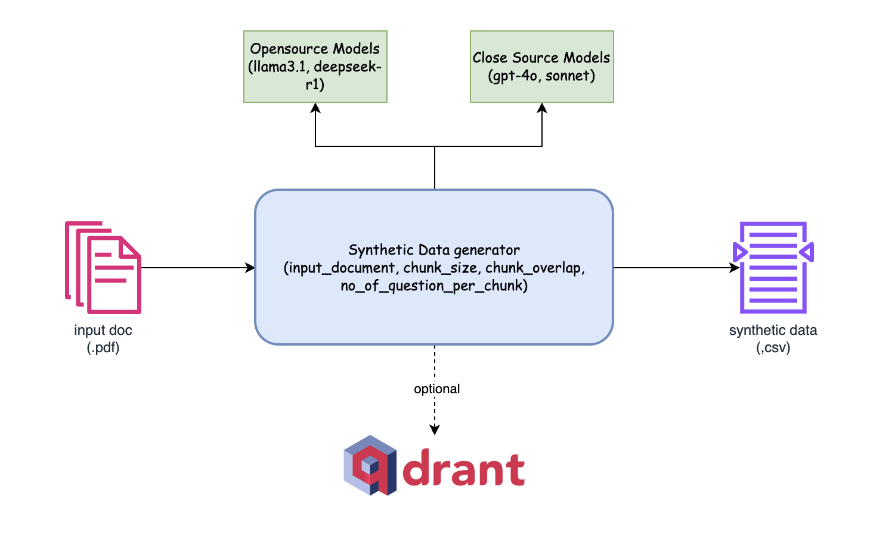

# Synthetic Data Generator for RAG Evaluation

## Overview
The **Synthetic Data Generator** is a powerful tool designed to create high-quality synthetic data for evaluating various **Retrieval-Augmented Generation (RAG) methods**. It provides seamless integration with **Qdrant**, a high-performance vector database, allowing for real-time indexing of processed chunks. Additionally, it supports both **open-source** (Llama3.1, Deepseek-r1) and **closed-source** (GPT-4o, Sonnet) models, enabling flexible and scalable synthetic data generation.

## Features
- 📄 **Supports PDF Inputs**: Easily process and extract data from `.pdf` documents.
- 🔍 **Configurable Chunking**: Define `chunk_size`, `chunk_overlap`, and `no_of_question_per_chunk` for precise control over data generation.
- 🤖 **Multi-Model Integration**: Choose from **Open-Source Models** (Llama3.1, Deepseek-r1) or **Closed-Source Models** (GPT-4o, Sonnet) for synthetic data generation.
- 📑 **Structured Data Output**: Generates structured synthetic data in **CSV format**.
- 🧠 **Qdrant Integration**: Optionally index chunks in **Qdrant** for efficient retrieval and evaluation.

## Architecture


1. **Input Documents**: The tool ingests `.pdf` documents as input.
2. **Synthetic Data Generator**:
   - Splits input text into chunks based on `chunk_size` and `chunk_overlap`.
   - Generates synthetic data with a specified `no_of_question_per_chunk`.
   - Utilizes selected **open-source** or **closed-source** models.
3. **Output**:
   - Generates a **CSV file** containing structured synthetic data.
   - (Optional) Indexes processed chunks into **Qdrant** for efficient search and retrieval.

## Installation
### Prerequisites
Ensure you have the following dependencies installed:
```bash
pip install -r requirements.txt
```

### Clone the Repository
```bash
git clone git@github.com:pavanjava/synthetic_data_generator.git
cd synthetic-data-generator
```

## Usage
### Running the Synthetic Data Generator
```python
from synthetic_data_generator import SyntheticDataGenerator

generator = SyntheticDataGenerator(
    input_document="data/sample.pdf",
    chunk_size=500,
    chunk_overlap=100,
    no_of_question_per_chunk=5,
    model_type="open-source"  # Options: "open-source", "closed-source"
)

synthetic_data = generator.generate()
synthetic_data.to_csv("output/synthetic_data.csv", index=False)

def generate_question_prompt(self, chunk: str, num_questions: int) -> str:
        prompt = f"""
                You are an AI assistant tasked with generating a single, realistic question-answer pair based on a given document. 
                The question should be something a user might naturally ask when seeking information contained in the document.
                
                Given: {chunk}
                
                Instructions:
                1. Analyze the key topics, facts, and concepts in the given document, only focus on the chosen topic, concepts.
                2. Generate {num_questions} similar questions that a user might ask to find the information in this document that does NOT contain any company name.
                3. Use natural language and occasionally include typos or colloquialisms to mimic real user behavior in the question.
                4. Ensure the question is semantically related to the document content WITHOUT directly copying phrases.
                5. Make sure that all of the questions are similar to each other. I.E. All asking about a similar topic/requesting the same information.
                
                Output Format:
                Return a JSON object with the following structure without back ticks:
                
                {{
                  "question_1": "Generated question text",
                  "question_2": "Generated question text",
                  ...
                }}
                
                Be creative, think like a curious user, and generate your {num_questions} similar questions that would 
                naturally lead to the given document in a semantic search. Ensure your response is a valid JSON object 
                containing only the questions nothing else no explanation, no reasons nor extra text.
                
                """

        return prompt
```

### Optional: Indexing with Qdrant
```python
from qdrant_client import QdrantClient
from llama_index.embeddings.huggingface import HuggingFaceEmbedding

  self.model = HuggingFaceEmbedding(
            model_name="llamaindex/vdr-2b-multi-v1",
            device="mps",  # "mps" for mac, "cuda" for nvidia GPUs
            trust_remote_code=True,
        )

documents = [{"chunk": chunk}]
        text_embeddings = self.model.get_text_embedding_batch([doc["chunk"] for doc in documents])
        self.client.upload_points(
            collection_name=self.COLLECTION_NAME,
            points=[
                models.PointStruct(
                    id=str(uuid.uuid4()),
                    vector={
                        "chunk": text_embeddings[idx],
                    },
                    payload=doc
                )
                for idx, doc in enumerate(documents)
            ]
        )
```

## Configuration
Modify the `config.yaml` file to adjust processing parameters:
```yaml
chunk_size: 500
chunk_overlap: 100
no_of_question_per_chunk: 5
model_type: "open-source"
qdrant_enabled: true
```

## Contributing
We welcome contributions! Feel free to open an issue or submit a pull request.

## License
This project is licensed under the Apache 2.0 License.

## Contact
For any queries, reach out to **M K Pavan Kumar** at [manthapavankumar11@gmail.com].